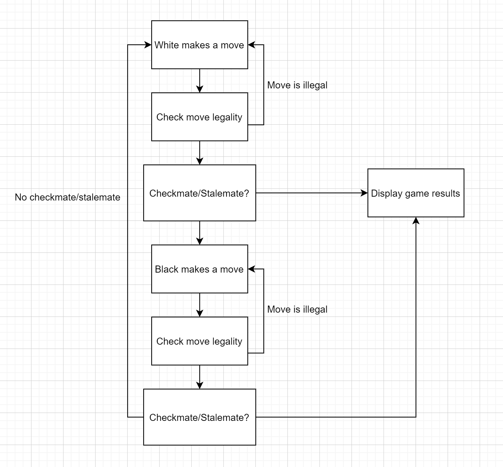

# Design

## General Game Flow
  

## The Chess Board
The chess board consists of a 2D array of 8x8 Squares.

## Chess Piece
A chess piece move type is a tuple of type integer (x, y) where x is the row offset and y is the column offset 
indicating the direction the piece can move, e.g. if a piece has a move type (1, 1) then the piece can move to square located from the 
piece's current row+1 and the piece's current column+1.

### Piece.cs  
Abstract class to define/implement <b>core</b> states and behaviors among all chess pieces  
- [x] Piece color  
- [x] Piece move type  
- [x] Current square
- [x] Has moved
- [x] Override ToString, return first letter of piece type
- [ ] Possible piece moves

#### King.cs and Rook.cs
Piece with specific states and behaviros unique to that chess peice
- [ ] Queen/King side castle

## Chess Board Square
### Square.cs 
- [x] Current piece on square

### ChessBoard.cs
- [x] Initialize chess pieces on board
- [x] Track chess pieces on board
- [ ] Generate possible moves for a piece
- [ ] Allow user input to move a piece
- [ ] Validate piece move

## Game Properties
### GameProperties.cs
- [x] Chess game colors
- [x] Chess board square notations
- [x] Chess board file numbers
